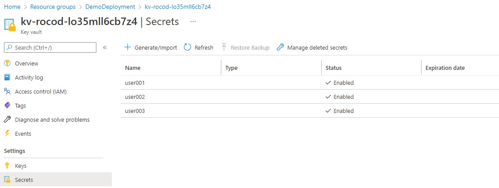

# Creating Accounts During Deployment

During the deployment you can choose to create Azure Active Directory accounts by specifying the usernames in a grid on the Add Users blade.

## Marketplace Offering UI

On the Add Users blade selecting to create users at this time will display a User grid. At this grid you can enter any usernames you want to create in Azure Active Directory. The users will be created and a random password will be generated and stored in the KeyVault deployed during the deployment.

## Accessing Created User's Passwords

Passwords are generated during deployment and accounts are set to change password on first logon. The passwords can be found in the KeyVault that is deployed during the deployment under Secrets. Each secret will be the name of the username.

The security group created (sg-{ProjectName}-avdadmin) has access to access the secrets created. In this example the Project Name is 'rocod'.

Under the Resource Group the deployment was deployed to, there is a KeyVault that is created named kv-{ProjectName}-{DeploymentGUID} (in this example kv-rocod-lo35mll6cb7z4). Under Secrets you will see all the usernames specified during the Add Users step. Each of these secrets has a random password stored.

