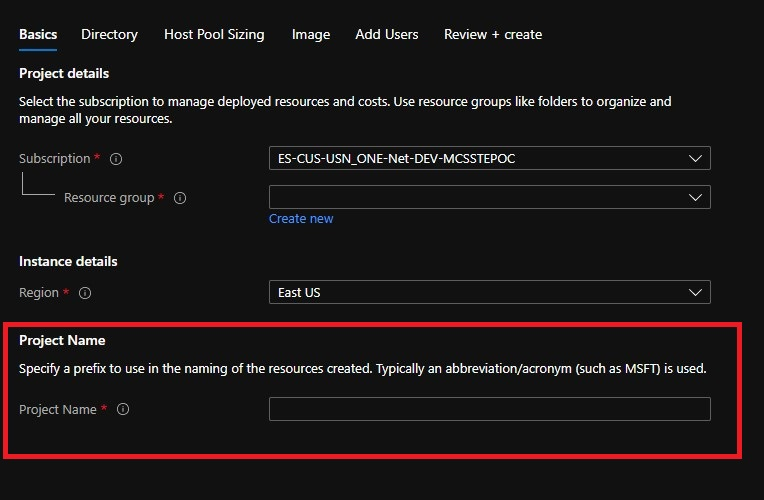

# Deployment Naming Convention

{ProjectName} - This is what is specified in the UI for Project Name on the Basics Blade.

Below is the naming convention used for all the resources created.

|Resource |Naming |
--- | --- |
Virtual Network | vn-avd-{ProjectName}
Network Security Group | nsg-avd-{ProjectName}
KeyVault | kv-{ProjectName}-{DeploymentGuid}
Host Pool | hp-avd-{ProjectName}
Application Group | hp-avd-{ProjectName}-DAG
Workspace | {projectName}-wkspace01
Virtual Machine | avd-{ProjectName}-{VMCount}
